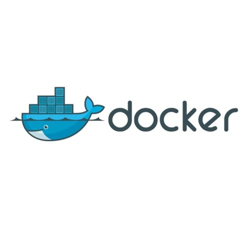
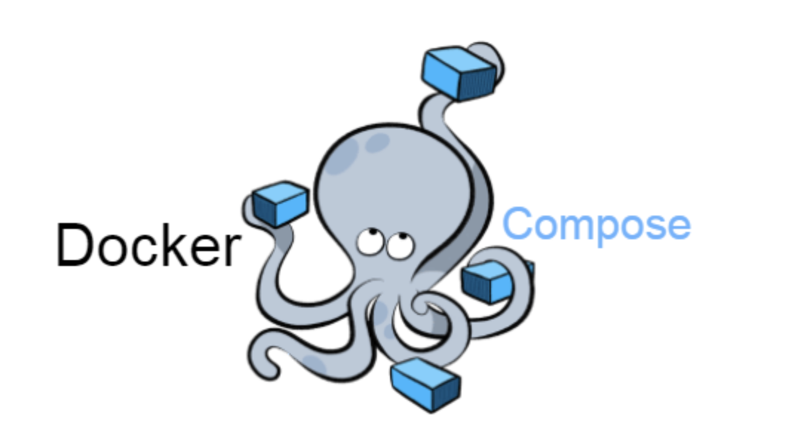

# 1. 도커(Docker) 개요

## 1-1. 도커(Docker)란?

- 도커(Docker)는 리눅스 응용 프로그램들을 프로세스 격리 기술들을 사용해 컨테이너로 실행하고 관리하는 오픈 소스 프로젝트이다.

- 컨테이너 기반 오픈소스 가상화 플랫폼 이라고 정의할 수 있다.

  

      
      
  

  > 도커 컨테이너는 일종의 소프트웨어를 소프트웨어의 실행에 필요한 모든 것을 포함하는 완전한 파일 시스템 안에 감싼다. 여기에는 코드, 런타임, 시스템도구, 시스템 라이브러리 등 서버에 설치되는 무엇이든 아우른다. 이는 실행 중인 환경에 관계 없이 언제나 동일하게 실행될 것을 보증한다.
  >
  > 출처 : [도커 공식 홈](https://www.docker.com/why-docker)

- 도커는 리눅스에서 운영 체제 수준의 가상화의 추상화 및 자동화 게층을 추가적으로 제공한다. 도커는 cgroups와 커널 이름 공간과 같은 리눅스 커널의 기능들과 OverayFS, aufs와 같은 유니언 가능 파일 시스템의 리소스 격리 기능을 사용하며, 이를 통해 독립적인 컨테이너가 하나의 리눅스 인스턴스 안에서 실행할 수 있게 함으로써 가상 머신을 시작하여 유지보수를 해야 하는 부담을 없애준다.

- 프랑스의 PaaS 기업인 닷클라우드 라는 회사에서 솔로몬 하익스가 내부 프로젝트로서 도커를 시작했고, 2013년 3월 오픈 소스로 출시되었다.

## 1-2. 도커(Docker) 이미지와 컨테이너

- 도커 이미지와 컨테이너는 도커를 이해하는데 있어 가장 중요한 개념이다.

  <table>
      <tr>
      	<th>구분</th>
          <th>설명</th>
      </tr>
      <tr>
      	<td>이미지(Image)</td>
          <td>
          	서비스 운영에 필요한 서버 프로그램, 소스코드 및 라이브러리, 컴파일 된 실행 파일을 묶는 형태를 도커 이미지라고 한다.  
              즉, 특정 프로세스를 실행하기 위한 모든 파일과 설정값을 지닌 파일들의 묶음으로 볼 수 있다. 
              도커 이미지들은 github와 유사한 서비스인 DockerHub를 통해 버젼관리 및 배포가 가능하다.
          </td>
      </tr>
      <tr>
          <td>컨테이너(Container)</td>
          <td>이미지를 실행한 상태로, 응용 프로그램의 종속성과 함께 응용프로그램 자체를 패키징 or 캡슐화 하여 격리된 공간에서 프로세스를 동작시키는 기술이다. 
          </td>
      </tr>
  </table>

## 1-3. 도커(Docker)의 사용 이유

### 1-3-1. 도커의 장점

- VM을 사용하지 않고 도커 엔진을 이용하여 동작하기 때문에 성능 개선과 동시에 메모리 용량을 적게 요구한다.
- 컨테이너를 실행하기 위한 모든 정보를 가지고 있기 때문에, 새로운 환경에서 이것 저것 설치할 필요 없이 새로운 서버에 이미지만 다운받아서 컨테이너를 생성할 수 있다.
- 개발환경 설정할 때 초기 세팅이 빠르고 실행환경을 강제화할 수 있다.
- 도커는 개발자가 원하는 환경 세팅을 모듈식 유닛을 조합함으로써 만들수 있게 해준다. 이는 개발 주기, 기능 배포, 버그 수정의 속도를 높여준다.

## 1-3. 도커의 도구

<table>
    <tr align="center">
    	<th>명칭</th>
        <th>로고</th>
        <th>설명</th>
    </tr>
    <tr>
        <td align="center">도커 컴포즈(Docker compose)</td>
    	<td align="center"></td>
        <td>멀티 컨테이너 도커 애플리케이션을 정의하고 실행하는 도구이다. 
            YAML 파일을 사용하여 애플리케이션의 서비스를 구성하며 하나의 명령을 가지고 모든 컨테이너의 생성 및 시작 프로세스를 수행한다.
        </td>
    </tr>
    <tr>
        <td align="center">도커 스웜(Docker swar)</td>
        <td align="center"></td>
        <td>도커 컨테이너의 네이티브 클러스트링 기능을 제공하며 도커 엔진을 하나의 가상 도커 엔진으로 탈바꿈시킨다.  
            도커 1.12 이상부터 Swarm 모드가 도커 엔진에 통합되어 있다.
        </td>
    </tr>
</table>

