# 3. 도커 사용하기

## 3-1. 도커 허브(docker hub) 가입하기

- 도커의 이미지를 저장하는 저장소의 기능을 사용하려면 도커 허브(docker hub)에 가입이 되어 있어야 한다.

  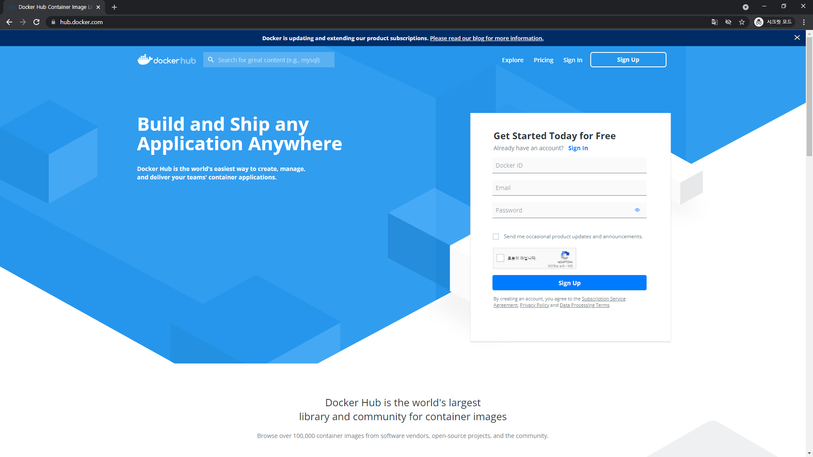

  

- Sign Up을 눌러서 도커 허브(Docker hub)에 가입을 해 준다.

  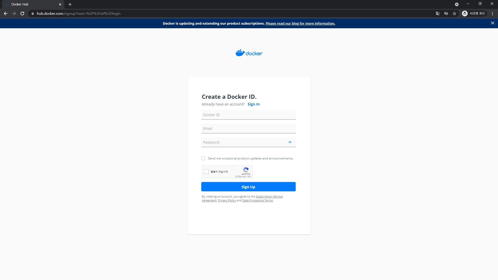


- 가입한 이메일에서 이메일 인증을 진행해주면 도커 허브를 이용할 수 있게 된다.

  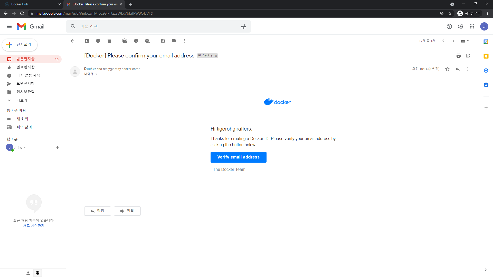

  

- 도커 허브에 가입 후 Docker를 이용 시 로그인을 하여 저장소의 이미지를 다운 받아 사용할 수 있다.

- Window 명령 프롬프트 혹은 powershell을 이용하여 도커 허브에 로그인을 해준다.

  ```powershell
  $ docker login
  ```

  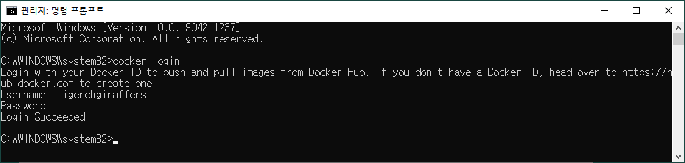

  

## 3-2. 원격 저장소에서 로컬 저장소로 도커 이미지 가져오기

### 3-2-1. 원격 저장소에서 이미지 다운로드

- 도커 허브(Docker hub) - 원격 저장소 에서 hello-world 라는 이름의 도커 이미지를 다운 받을 것이다.

  ```powershell
  $ docker pull hello-world
  ```

  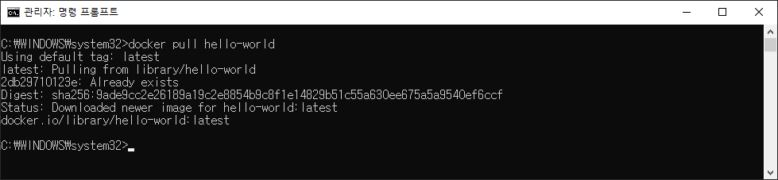

  

- 다운 받은 hello-world 이미지가 로컬 저장소에 있는지 이미지 리스트를 확인 해 볼 것이다.

  ```powershell
  $ docker images
  ```

  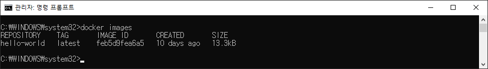

  

### 3-2-2. 로컬에 저장된 이미지로 컨테이너 생성 후 실행

- 로컬에 등록된 이미지를 컨테이너로 생성해 실행해 볼 것이다.

  ```powershell
  $ docker run hello-world
  ```

  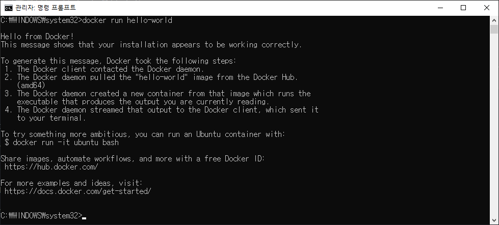

> 참고로 run 명령은 pull 명령도 포함이 되어 있다. 컨테이너를 생성할 이미지가 존재하지 않으면 원격 저장소에서 찾아 pull 명령을 실행한 후 run 명령을 실행하게 된다.


### 3-2-3. 실행중인 컨테이너 리스트 확인

- 실행중인 컨테이너 리스트 확인하기 

  ```powershell
  $ docker ps
  ```

  

- 모든 컨테이너 리스트 확인하기

  ```powershell
  $ docker ps -a
  ```

  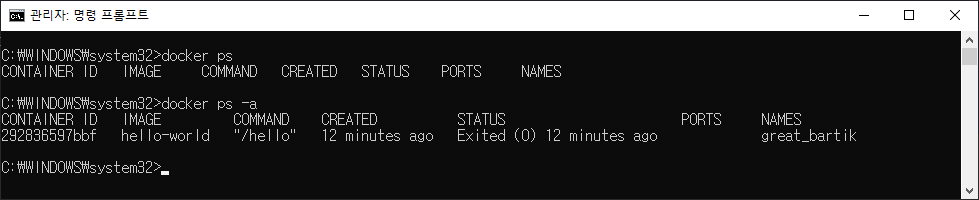

> hello-world 이미지를 기반으로 한 컨테이너가 만들어 졌음을 확인할 수 있다. 상태는 중지된 상태(Exited)로 되어 있으며, 컨테이너의 이름은 별도로 지정해 주지 않는 경우 run 명령 시 자동으로 부여된다.


### 3-2-4. 컨테이너 실행 시 이름 부여하기

- 컨테이너 실행을 위한 run 명령 시 --name 옵션을 이용하여 생성되는 컨테이너의 이름을 부여할 수 있다.

  ```powershell
  $ docker run --name hello hello-world
  ```

  > docker run --name [생성할 컨테이너의 이름] [실행할 이미지 이름]

  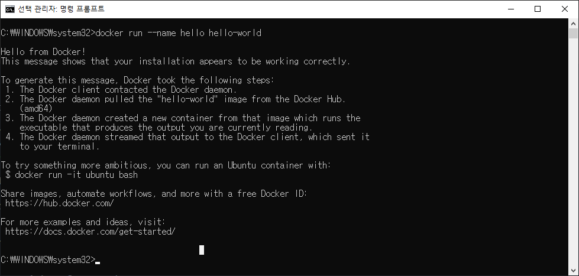

  

- 컨테이너 목록을 확인해보면 hello 라는 이름의 컨테이너가 생성된 것을 확인할 수 있다.

  ```powershell
  $ docker ps -a
  ```

  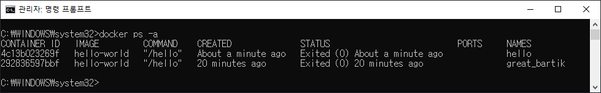

  > 하나의 hello-world 이미지로 두 개의 서로 다른 이름 가진 컨테이너(container)가 생성된 것을 볼 수 있다. 이처럼 다른 name을 부여하게 되면 여러 개의 컨테이너를 실행할 수 있게 된다.

  

### 3-2-5. 컨테이너 삭제하기

- rm 명령을 이용하여 사용하지 않는 컨테이너는 삭제할 수 있다. 이 때 컨테이너의 ID나 NAME을 이용하여 컨테이너를 삭제할 수 있다.

  ```powershell
  $ docker rm great_bartik
  ```

  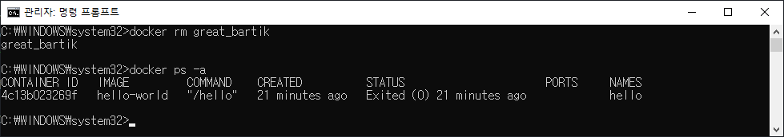

> 참고로 현재 명령은 컨테이너가 중지된 경우에만 사용 가능하다. 현재 hello-world 컨테이너는 중지 상태이기 때문에 바로 삭제가 가능하다.

### 3-2-5. 이미지 삭제하기

- rmi 명령을 이용하여 이미지를 삭제할 수 있다. 이미지를 삭제할 때는 이미지로부터 만들어진 컨테이너가 모두 삭제 되어 있어야 삭제가 가능하다.

  ```powershell
  $ docker rmi hello-world
  ```

  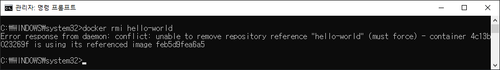

  

- 지우려는 이미지로 생성된 컨테이너 지우기

  ```powershell
  $ docker rm hello
  ```

  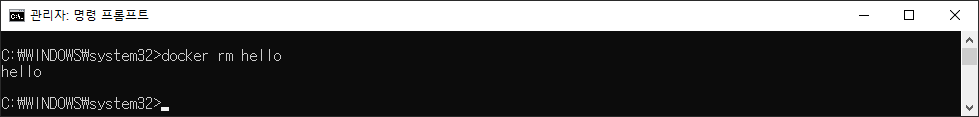

  

- 컨테이너 제거 후 이미지 지우기

  ```powershell
  $ docker rmi hello-world
  ```

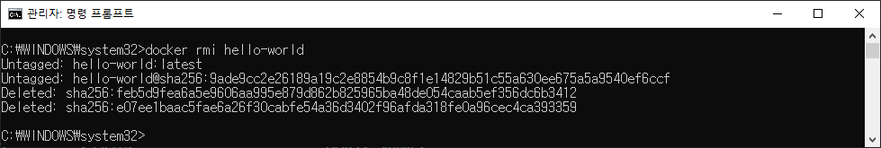

