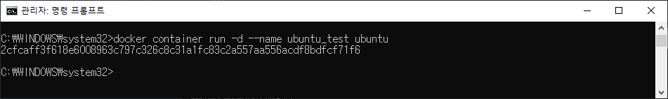
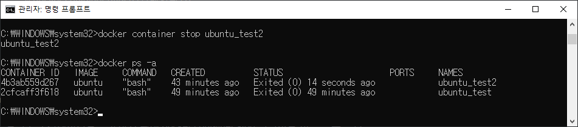

# 4. Docker 기본 명령어

## 4-1. 도커 명령어 구조

- 도커의 명령어는 크게 이미지 관련, 컨테이너 관련, 축약 명령어, 운용 관련 명령어 등으로 나누어 진다. 도커의 기본 명령어 구조는 아래와 같다.

  >  $ docker [명령어] [옵션]


## 4-2. 도커 도움말

- 도커 도움말은 명령어 창에서 help로 확인할 수 있다.

  ```powershell
  $ docker help
  ```


- 도커 명령어 별 상세 사용 방법은 아래와 같이 확인할 수 있다.

  > $ docker [명령어] --help

  ```powershell
  $docker search --help
  ```

  


## 4-3. 이미지 관련 명령어

### 4-3-1. 도커 이미지 검색하기

- DockerHub 레지스트리에서 도커 이미지를 검색한다.

  > $ docker search [이미지이름]

- 우분투 이미지를 검색해보면 우분투 이미지 관련 이미지가 다수 검색된다. 검색 결과는 stars 순이다. 대부분 목록을 보면 xxxxx/ubuntu 같은 네임스페이스가 붙지만 첫 번째 아이템은 네임스페이스가 없이 ubuntu로만 되어 있다. OFFICIAL에 OK가 체크된 이미지는 공식 레포지토리인 경우인데, 이 경우는 네임스페이스가 생략된다.

```powershell
$ docker search ubuntu
```


### 4-3-2. 이미지 다운로드 하기

- 도커 이미지를 도커 레지스트리에서 다운받으르면 docker image pull 명령어를 이용한다.

> $ docker image pull [옵션] 리포지토리명[:태그명]

- 우분투 이미지를 다운로드 받아 볼 것이다. 태그명을 생략하면 기본적으로 latest가 적용된다.

  ```powershell
  $ docker image pull ubuntu
  ```

  


### 4-3-3. 이미지 목록 보기

- 현재 보유하고 있는 이미지 목록을 보기 위해서는 docker image ls 명령어를 이용한다.

  > $ docker image ls

  ```powershell
  $ docker image ls
  ```

  

  

## 4-4. 컨테이너 관련 명령어

### 4-4-1. 컨테이너 실행하기

- 도커 컨테이너를 실행하기 위해서는 docker container run 명령어를 이용한다.

  > $ docker container run [옵션] 이미지명[:태그명]


- ubuntu 이미지를 백그라운드에서 실행하려면 -d 옵션을 주고 실행한다.

  ```powershell
  $ docker container run -d --name ubuntu_test ubuntu
  ```

  

  

- 사용 가능한 컨테이너 옵션은 아래와 같다.

  | 옵션   | 설명                                                         |
  | ------ | ------------------------------------------------------------ |
  | -d     | 백그라운드로 실행한다.                                       |
  | -p     | 외부포트:컨테이너포트<br />포트를 지정하지 않는 경우 임의의 포트가 자동으로 할당된다. |
  | -t     | 유닉스 터미널 연결 활성화를 시킨다.<br />-i 옵션과 같이 많이 사용되며 -it 옵션으로 합쳐서 실행한다. |
  | -i     | 컨테이너 쪽 표준 입력(stdout)과 연결을 유지한다.<br />컨테이너 쪽 셸에 들어가려면 이 옵션을 추가해야 한다. |
  | -rm    | 컨테이너가 종료 시 컨테이너를 파기한다.                      |
  | --name | 컨테이너에 원하는 이름을 붙일 수 있다.<br />생성된 컨테이너는 이름으로 조회를 하거나 삭제할 수 있다.<br />name을 부여하지 않고 컨테이너를 생성하면 랜덤한 이름이 생성된다. |


- -it 옵션을 주어 실행중인 컨테이너의 터미널을 이용할 수 있다.

  ```powershell
  $ docker container run -it --name ubuntu_test2 ubuntu
  ```

  

> 도커 컨테이너 내부 쉘에서 나가기 위해서는 exit 명령어를 이용할 수 있다. (단축키 : Ctrl + D) 이 때 컨테이너를 종료시키지 않고 나오기 위해서는 Ctrl + P, Q를 누르면 컨테이너를 종료시키지 않게 된다.
>
> 다시 컨테이너로 들어가기 위해서는 docker attach 명령어를 이용할 수 있다.


### 4-4-2. 실행중인 컨테이너 목록 조회하기

- 실행중인 컨테이너를 조회하기 위해서는 docker container ls 명령어를 이용할 수 있다.

  ```powershell
  $ docker container ls
  ```

  

  

- 종료된 컨테이너의 목록을 조회하거나 컨테이너의 특정 조건을 필터링 해서 볼 수 있는 다양한 옵션을 제공하고 있다.

  | 옵션 | 설명                                                         |
  | ---- | ------------------------------------------------------------ |
  | -a   | 모든 컨테이너 목록 조회 (종료된 컨테이너도 조회됨)           |
  | -f   | 컨테이너 목록 필터링 해서 보기 (예 : docker container ls -f "name=ubuntu") |
  | -n   | 모든 컨테이너 목록들 중 n번째 까지의 최근 목록을 보여준다. (예: docker container ls -n 3) |
  | -l   | 모든 컨테이너 목록 중 가장 최근의 컨테이너 목록을 보여준다.  |
  | -q   | 실행중인 컨테이너의 아이디를 보여준다.                       |
  | -s   | 실행중인 컨테이너의 파일 사이즈를 보여준다.                  |


### 4-4-3. 실행중인 컨테이너로 들어가기

- 실행중인 컨테이너 내부로 들어가기 위해 docker container attach 명령어를 이용할 수 있다.

  > $ docker container attach [컨테이너명]

  ```powershell
  $ docker attach ubunutu_test2
  ```


### 4-4-4. 실행중인 컨테이너 정지하기

- 실행중인 컨테이너를 종료하기 위해 docker container stop 명령어를 이용할 수 있다.

  > $ docker container stop [컨테이너아이디 | 컨테이너명]

  ```powershell
  $ docker container stop ubuntu_test2
  ```

  


### 4-4-5. 정지된 컨테이너 시작하기

- 정지된 컨테이너를 시작하기 위해 docker container start 명령어를 이용할 수 있다. (아이디를 입력하는 경우에는 컨테이너를 식별 가능한 정도로 일부만 작성해도 된다.)

  > $ docker container start [컨테이너아이디 | 컨테이너명]

  ```powershell
  $ docker container start 4b
  ```

  

  

### 4-5-6. 컨테이너 재시작하기

- 컨테이너를 재시작 하는 경우 docker container restart 명령어를 이용할 수 있다.

  > $ docker container restart [컨테이너아이디 | 컨테이너명]

  ```powershell
  $ docker container restart ubuntu_test2
  ```

  


### 4-5-7. 컨테이너 삭제하기

- 컨테이너를 삭제할 시 docker container rm 명령어를 이용할 수 있다. (기본 옵션으로는 실행중인 컨테이너를 삭제할 수 없기 때문에 종료하고 삭제해야 함.)

  > $ docker container rm [컨테이너아이디 | 컨테이너명]

  ```powershell
  $ docker container rm ubuntu_test
  $ docker container rm ubuntu_test2
  ```

  

  

- 실행중인 컨테이너를 삭제하기 위한 방법

  1. 컨테이너 생성 시 --rm 옵션 부여하면 컨테이너 종료 시 자동 파기됨

  2. 실행중인 컨테이너 종료 후 컨테이너 삭제

  3. 컨테이너 삭제 시 -f 옵션 부여 후 삭제 (실행중인 컨테이너 강제 종료 후 삭제하는 옵션)

     ```powershell
     $ docker container rm -f ubuntu_test2
     ```

     


## 4-5. 축약 명령어

- 도커의 이미지, 컨테이너 관련 명령어는 축약 명령어도 제공하고 있다. 하지만 축약 명령어보다는 full 명령어를 사용하는 것을 권장한다.

  | 도커 full 명령어       | 축약 명령어   |
  | ---------------------- | ------------- |
  | docker image pull      | docker pull   |
  | docker image ls        | docker images |
  | docker container run   | docker run    |
  | docker container start | docker start  |
  | docker container ls    | docker ps     |
  | docker container stop  | docker stop   |

  

## 4-6. 운용 관련 명령어

### 4-6-1. 컨테이너 및 이미지 파기하기

- 현재 실행중이지 않은 모든 컨테이너를 삭제할 때 docker container prune 명령어를 사용한다.

  ```powershell
  $ docker container prune
  ```

  


- 태그가 붙지 않은 모든 이미지를 삭제할 때 docker image prune 명령어를 사용한다.

  ```powershell
  $ docker image prune
  ```

  


- 이미지(태그가 없는 이미지), 컨테이너, 볼륨, 네트워크 등 모든 리소스를 일괄 삭제할 때 docker system prune 명령어를 사용한다.

  ```powershell
  $ docker run -d --name ubuntu_test3 ubuntu
  $ docker ps -a
  $ docker system prune
  $ docker ps -a
  ```

  

  

### 4-6-2. 컨테이너 시스템 리소스 사용 현황 확인하기

- 현재 실행중인 컨테이너가 있다면 docker container stats명령어를 이용하면 실시간으로 리소스 사용 현황을 보여준다.

  ```powershell
  $ docker container run -it --name ubuntu_test3 ubuntu
  ctrl + P,Q
  
  $ docker container ls -a
  $ docker container stats ubuntu_test3
  ctrl + C
  ```

  

