# 5. Docker이미지만들기


## 5-1. Docker 이미지

### 5-1-1. Docker 이미지란?

> 도커에서 이미지는 컨테이너와 함께 가장 중요한 개념이다. 모든 컨테이너는 이미지를 바탕으로 실행되며, 이 때 이미지는 컨테이너가 실행되는 파일시스템이다. 도커에서는 다양한 베이스 이미지와 애플리케이션 이미지를 제공하고 있으며, 사용자는 이러한 이미지를 기반으로 해서 새로운 커스텀 이미지를 만들 수 있다.

### 5-1-2. 커스텀 이미지

> 특정 애플리케이션이 실행 가능한 프로비저닝된 환경을 구축하고 언제, 어디서나 컨테이너로 실행하는 것이 가능하도록 한다.


## 5-2. Dockerfile 명령어

| 명령어     | 설명                                                         |
| ---------- | ------------------------------------------------------------ |
| FROM       | 베이스 이미지를 설정하는 명령어(<이미지 이름>:<태크> 형식으로 설정) |
| MAINTAINER | 관리자의 정보를 기재하는 부분, 빌드에 영향을 주지 않기 때문에 생략하는 경우도 있다. |
| COPY       | 파일이나 디렉토리를 이미지로 복사하는 명령어<br />소스를 복사할 때 많이 사용된다.<br />이미지 파일이 위치할 경로는 절대 경로 방식으로 설정해야 한다.<br />URL을 사용할 수 없고 압축이 해제되지 않고 그대로 복사된다. |
| ADD        | 파일이나 디렉토리를 이미지로 복사하는 명령어이다.<br />COPY 명령어와 비슷하지만 ADD는 상대 경로를 사용할 수 있고, URL을 사용할 수 있다.<br />또한 압축 파일이 있으면 압축 파일을 풀어서 추가한다. |
| RUN        | 이미지를 만드는 과정에서 이미지에서 사용해야 하는 명령어를 실행해주는 명령어 |
| CMD        | 컨테이너가 실행되었을 때 실행되는 명령어를 정의하는 명령어<br />Dockerfile에 CMD 명령어가 여러 번 사용되어도 맨 마지막 명령어만 유효하다.<br />여러 명령어를 실행하고자 한다면 run.sh 파일을 만들어 해당 파일에 실행하고자 하는 명령어를 입력해 주어야 한다.<br />docker run을 통해 인자값을 전달하면 CMD 명령어에 명시된 인자는 무시한다. (매개변수 영향 받음) |
| ENTRYPOINT | 컨테이너가 run으로 실행되었을 때 실행되는 명령어를 정의하는 명령어이다.<br />CMD 명령어와 유사하지만 run을 통해 인자값이 전달되어도 ENTRYPOINT로 지정해 놓은 명령어가 그대로 실행된다. (매개변수 영향 없음) |
| WORKDIR    | COPY, ADD, RUN, CMD 등이 수행될 기본 디렉토리를 설정해주는 명령어 |
| EXPOSE     | 컨테이너와 호스트를 연결할 포트를 지정해주는 명령어          |
| ENV        | RUN, CMD, ENTRYPOINT 명령어에서 사용하는 환경변수를 지정하는 명령어<br />사용 시 환경변수명 앞에 $를 붙여 사용한다. |
| VOLUME     | 컨테이너 외부에 파일 시스템을 연결하기 위해 사용한다.        |


## 5-2. Docker 이미지 생성 따라해보기

### 5-2-1. 이미지로 만들 프로젝트 생성하기

> Docker 이미지를 만들때 사용할 Jar를 생성하기 위해 Springboot를 이용하여 간단한 API 요청 받을 수 있도록 
> 작업 진행. @RestController 어노테이션을 이용하여 RestAPI 요청을 받을 수 있도록 하였으며, 
> "/"으로 GET 요청이 들어오면 Hello Docker World 가 응답되도록 하였다.

- intellij 로 Spring boot 2.5.12 버전, 자바 11 버전의 간단한 스프링부트 + 메이븐 프로젝트 생성

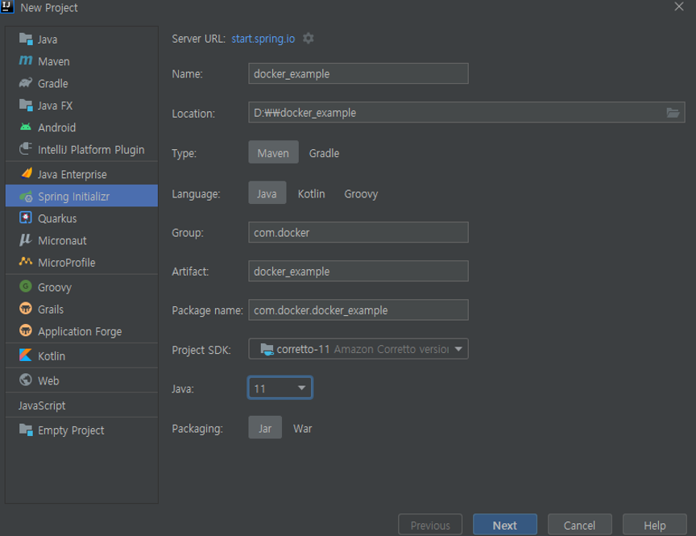

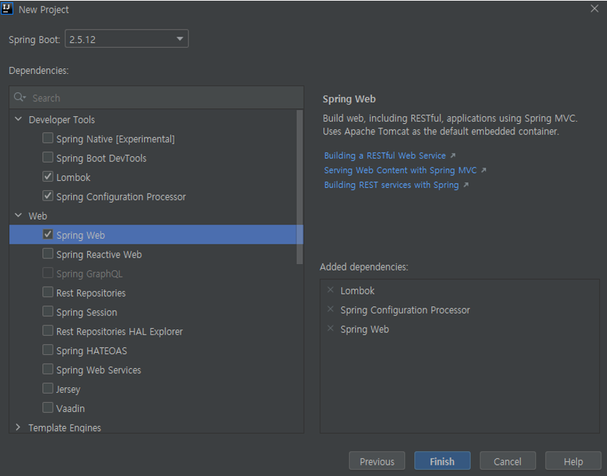

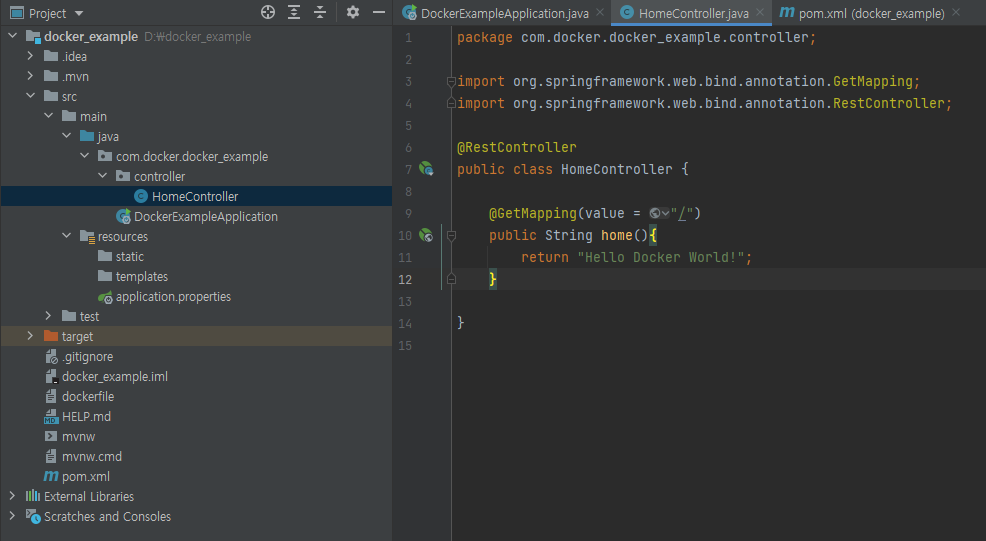

- 빌드를 진행하여 JAR 파일로 생성한다.
> 주의할 점은 테스트를 포함하여 빌드할 경우 에러가 발생할 수 있으니, 제외하고 진행을 한다. 
> 인텔리제이 하단에 Terminal 을 클릭하여 아래와 같이 명령어를 입력한다.

```powershell
$ mvnw -Dmaven.test.skip=true package
$ ./gradlew build -x test

```

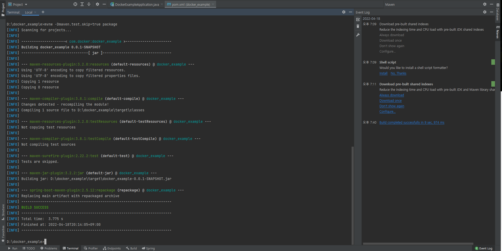

- 프로젝트 폴더 이하 target 내에 jar가 생성된 것을 확인한다.

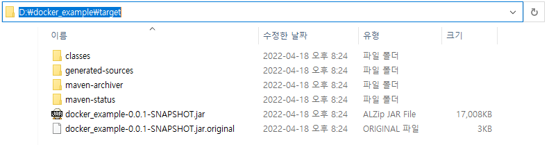

- 프로젝트 최상위 폴더에 Dockerfile을 생성하여 설정을 세팅하여 저장
> dockerfile의 경우 확장자가 없이 만들어야한다. 
> window에서 확장자가 없는 파일 만드는 방법은 원하는 편집기로 설정을 입력한 후, 파일을 저장할 때 파일형식은 모든 파일로 변경하고, 파일이름엔 따옴표를 포함하여 "dockerfile" 로 저장한다.
> dockerfile은 프로젝트 최상위 폴더에 만든다.

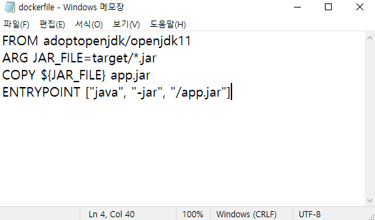

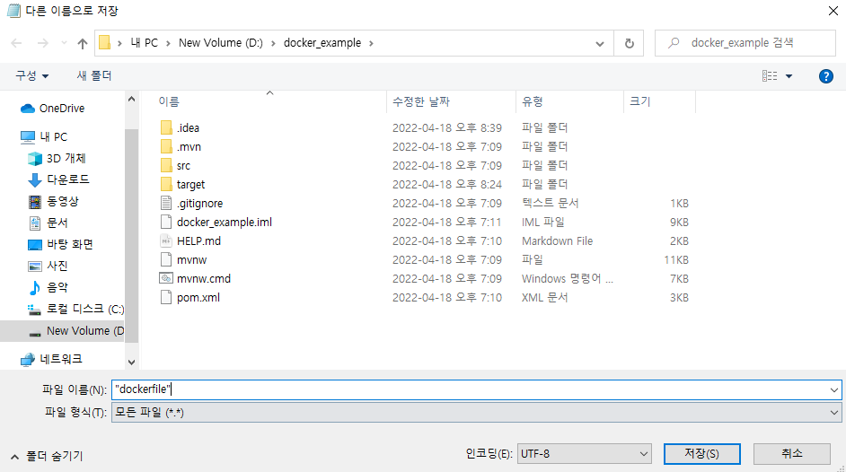


### 5-2-2. 이미지 빌드하기

> 이미지로 만들 프로젝트와 Dockerfile을 생성한 뒤에 해당 파일들을 통해 이미지를 생성한다.
> Dockerfile을 빌드할 때는 도커파일을 포함하고 있는 디렉터리의 서브 디렉터리까지 모두 Docker 데몬에서 처리하기 때문에
> 불필요한 파일이 포함되지 않도록 조심한다.

- 도커 빌드 옵션

| Docker Build 옵션 | 설명 | 
| :--- | ---- |
| --force-rm | 이미지 생성에 실패했을 때 임시 컨테이너 삭제 |
| --no-cache | 이전 빌드에서 생성된 캐시를 사용하지 않는다. <br> Docker는 이미지 생성 시간을 줄이기 위해 Dockerfile 각 과정을 캐시에 올리는데, 이 캐시를 사용하지 않고 처음부터 다시 이미지 생성 |
| -q, --quiet | Dockerfile 빌드 중에 RUN 과정의 결과를 출력하지 않는다. |
| --rm | 이미지 생성에 성공했을 때 임시 컨테이너 삭제 |
| -t, --tag | 저장소 이름, 이미지 이름, 태그를 설정한다. <br> <저장소 이름>/<이미지 이름>:<태그> 형식이며 태그 미지정시 latest로 자동 입력된다. |


```powershell
$ docker build -t {docker 이미지 이름}:{태그(버전관리용)} {작성한 Dockerfile 위치}

도커의 이미지 이름은 소문자로만 구성해야한다.
ex) docker build -t catohgiraffers/springbootdocker D:\docker_example

Dockerfile이 있는 위치에서 명령어를 실행할 경우 ./로 입력해도 된다.
ex) docker build -t catohgiraffers/springbootdocker ./
```

- Dockerfile 빌드 진행

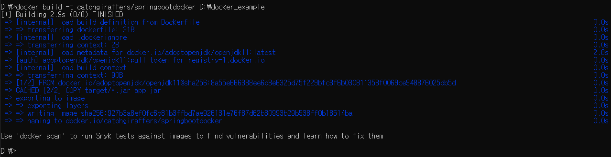

### 5-2-3. 이미지를 컨테이너화하여 실행하기

> docker run 명령어를 이용하여 생성한 Image를 Container로 생성하여 실행하여 본다. 
> docker run 에는 다양한 옵션이 있지만, 자주사용하는 몇가지 옵션만 사용하여 이미지를 컨테이너화한다.

| Docker Run 옵션 | 설명 |
| :----: | ---- |
| -i, <br>--interactive | 표준 입력(stdin)을 활성화하며, 컨테이너와 연결(attach)되어 있지 않더라도 표준 입력을 유지한다. 보통 이 옵션을 이용하여 bash에 명령을 입력한다. |
| -t, --tty | TTY모드(pseudo-TTY) 를 하용한다. BASH를 사용하려면 이 옵션을 설정해야 한다. 이 옵션을 설정하지 않더라도 명령은 입력할 수 있지만, 셸이 표시되지 않는다. |
| --name | 컨테이너 이름을 설정한다. |
| -d, <br>--detach | Detached 모드이다. 보통 데몬 모드라고 부르며, 컨테이너가 백그라운드로 실행된다. |
| -p, <br>--publish | 호스트와 컨테이너의 포트를 연결한다.(=포트포워딩) <br>ex) -p {호스트 포트}:{컨테이너 포트} |
| --privileged | 컨테이너 안에서 호스트의 리눅스 커널 기능(Capability)를 모두 사용한다. 호스트 주요 자원에 접근할 수 있다. |
| --rm | 프로세스 종료시 컨테이너 자동 제거한다. |
| --restart | 컨테이너 종료시, 재시작 정책을 설정한다. <br>ex) --restart="always" |
| -v, <br>--volume | 데이터 볼륨을 설정한다. 호스트와 컨테이너의 디렉터리를 연결하며, 파일을 컨테이너에 저장하지 않고 호스트에 저장한다.(=마운트) |
| -u, <br>--user | 컨테이너가 실행될 리눅스 사용자 계정 이름 또는 UID를 설정한다.<br>ex) --user root|
| -e, <br>--env | 컨테이너 내에서 사용할 환경 변수를 설정한다.<br> 보통 설정값이나 비밀번호를 전달할 때 사용한다.<br>-e GRANT_SUDO=yes |
| --link | 컨테이너끼리 연결한다. <br>ex) --link="catohgiraffers:db" |
| -h,<br>--hostname | 컨테이너의 호스트 이름을 설정한다. |
| -w,<br>--workdir | 컨테이너 안의 프로세스가 실행될 디렉터리를 설정한다. |
| -a,<br>--attach | 컨테이너의 포준 입력(stdin), 표준 출력(stdout), 표준 에러(stderr)를 연결한다. |
| -c,<br>--cpu-shares | CPU 자원 분배 설정을 할 수 있다. 기본값은 1024이다. |
| -m,<br>--memory | 메모리 한계를 설정한다. 단위는 b(byte), k(kilobyte), m(megabyte), g(gigabyte) 등으로 사용할 수 있다. |
| --gpus | 컨테이너에서 호스트의 NVIDIA GPU 를 사용할 수 있도록 설정할 수 있다. 단, 호스트는 NVIDIA GPU가 장착된 Linux 서버야하고, NVIDIA Driver가 설치되어있으며, Docker 19.03.5 버전 이상이어야 한다. <br><br>GPU모두 사용하기<br>ex) --gpus all <br><br>GPU 지정해서 사용하기<br>ex)--gpus "device=0.1" |
| --security-opt | SELinux, AppArmor 옵션을 설정할 수 있다.<br>--security-opt="label:level:TopSecret" |


- build 이후 만들어진 docker 이미지를 실행해본다.

```powershell
$ docker run -p {외부 포트번호}:{컨테이너 내부 포트번호} {이미지 이름}:{이미지 버전}
ex) docker run -p 60080:8080 -d catohgiraffers/springbootdocker:latest
```

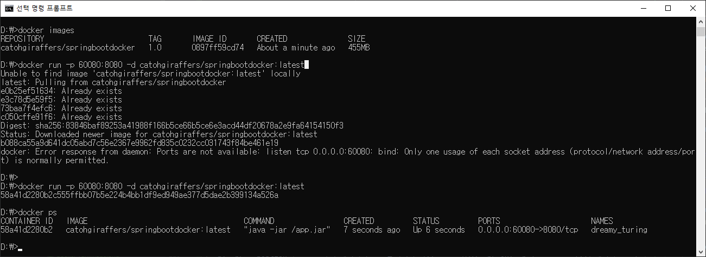

- 위 중간에 발생한 에러는 60080 포트를 다른 프로세스가 사용하고 있을 경우 발생한다.
> cmd 창을 열어 60080 포트를 사용하고 있는 프로세스를 찾아 작업관리자에서 해당 프로세스를 종료시킨다.
> 또는 cmd 창에 taskkill 명령을 사용하여 강제 종료 시킬수도 있다.

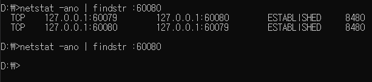

```powershell
$ taskkill /f /pid 8480
```


- WEB에서 URL 요청

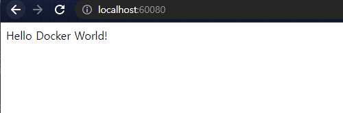

### 5-2-2. Dockerhub로 이미지 PUSH

- 도커에 로그인을 진행

```powershell
$ docker login
```

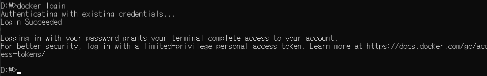

- 도커에 푸시

```powershell
$ docker push {이미지 이름}
```

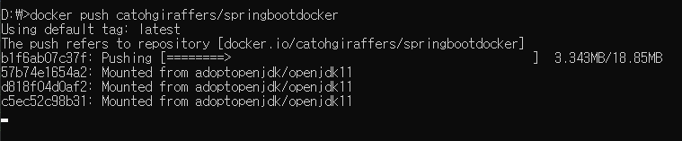

- PUSH가 잘 되었는지 [Docker hub](https://hub.docker.com/) 에서 확인

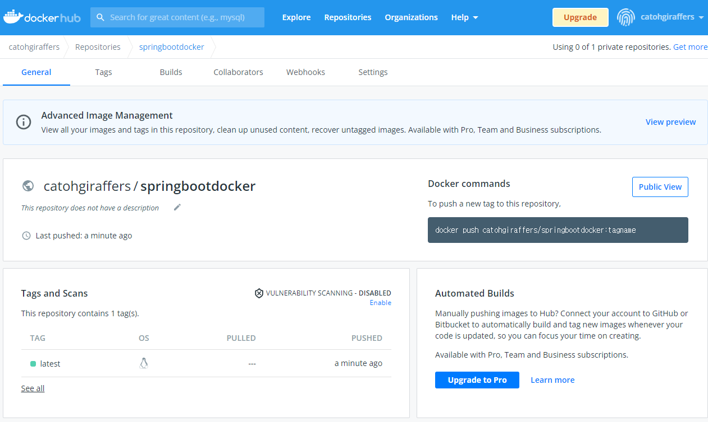
