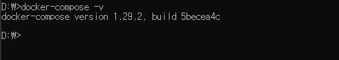
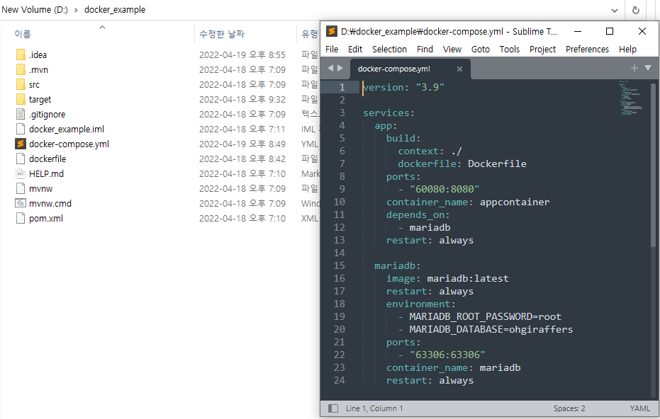
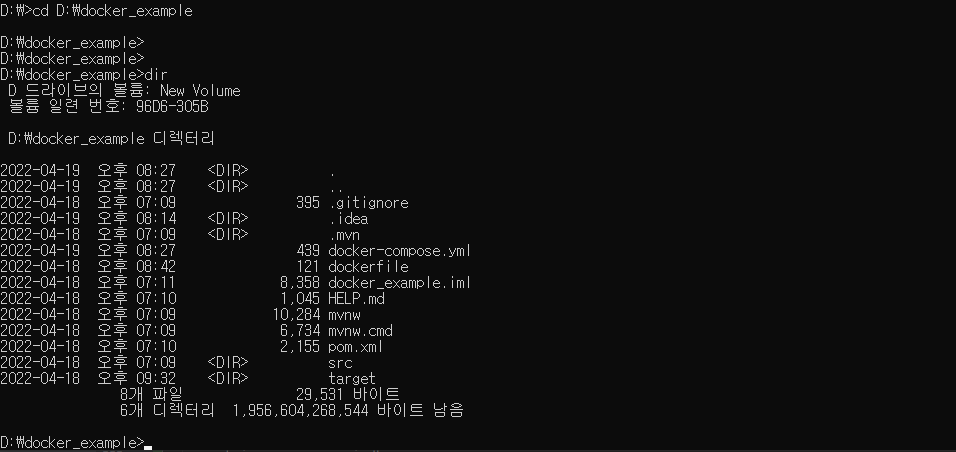
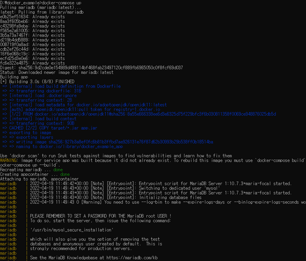
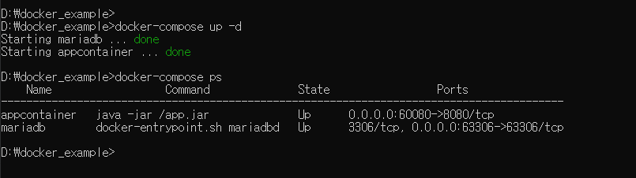

# 6. Docker 컴포즈


## 6-1. Docker 컴포즈 개요

### 6-1-1. Docker 컴포즈란?
> 일반적인 애플리케이션은 단일로 기동되어 작동하는 경우보다 여러 개의 애플리케이션이 서로 유기적으로 기동된다.
> 각 컨테이너가 하나의 애플리케이션을 담당하는 경우, 여러개의 컨테이너를 동시에 관리해야하는 역할이 필요하게 되었고,
> 이때 사용할 수 있는 툴이 도커 컴포즈이다. 도커 컴포즈는 yaml 포맷으로 설정파일을 작성해야한다.

### 6-1-2. yaml 이란?
- YAML Ain't Markup Language 의 약자
- JSON, XML 과 같이 시스템 같 데이터 교환을 위해 만들어졌으며, Key-Value 구조를 기본으로 한다.
- 대소문자를 구분하며 구조를 구분할 때는 들여쓰기를 기준으로 한다.
- 값으로 문자열, 숫자, boolean을 모두 가질 수 있다.
- 주석 표기는 # 으로 표시한다.
- YAML 파일에서 들여쓰기 할 때 탭은 도커 컴포즈가 인식하지 못하기 때문에 2개의 공백(Space)을 이용해 구분한다. 


- yaml 간단 예제
```powershell
person:
  name: catohgiraffer
  age: 24
  address: Korea
  phone: '01052520124'
  email: catohgiraffer@mail.com
```

## 6-2. docker-compose.yml 작성

- 예시
```powershell
version: "3"

services:
  app:
    build:
      context: ./DOCKER_EXAMPLE
      dockerfile: Dockerfile
    links:
      - "db:mysqldb"
    ports:
      - "8080:8080"
    container_name: web
    restart: always
    depends_on:
      - db
  db:
    image: mysql:5.7    
    volumes:
      - ./mysqldata:/var/lib/mysql
    environment:
      - MYSQL_ROOT_PASSWORD=catohgiraffers
      - MYSQL_DATABASE=cat0124!!
    ports:
      - "3306:3306"
    container_name: db
```

### 6-2-1. version

```powershell
version: "3"
```

- Docker Compose 파일 제일 위에는 버전을 명시해야한다. 각 버전별로 명령어와 표기법이 달라질수 있다.
- 버전관련 정보는 공식 홈페이지에서 확인한다. [Docker Docs](https://docs.docker.com/compose/compose-file/compose-file-v3/)


### 6-2-2. services

```powershell
services:
    app: 
        ...
    db:
        ...
```

- 서비스는 Compose에서 실행할 컨테이너에 대한 명세이다. 
- 각 서비스별로 옵션을 설정할 수 있다. 
- 서비스명은 컨테이너 명과 다른 개념이다. 동일하게 착각하면 안된다.

### 6-2-3. image

```powershell
services:
    app: 
        ...
        image: catohgiraffers:1.0
        ...
    db:
        ...
        image: mysql:5.7
        ...
```

- 컨테이너화할 이미지를 명시한다.
- dockerfile내에 FROM을 활용해 베이스 이미지 설정하는 것과 유사하다.

### 6-2-4. build

```powershell
services:
    app: 
        ...
        build:
            context: .
            dockerfile: Dockerfile
        ...
    db:
        ...   
```

- 로컬에 이미지가 존재하거나 Docker Hub에 Push한 이미지가 있다면 이미지명과 태그명을 활용하여 컨테이너를 구성할수 있다.
- 일반적으로는 dockerfile에 명시된 이미지를 기반으로 컨테이너를 구성한다.

### 6-2-5. command

```powershell
services:
    app: 
        ...
        build:
            context: .
            dockerfile: Dockerfile
        command: java -jar app.jar
        ...
    db:
        ...   
```

- 컨테이너화할 곳에 명령을 미리 세팅할 수 있다. 
- 보통 컴파일러나 특정 언어로 작성된 애플리케이션을 실행할 때 사용한다.

### 6-2-6. port

```powershell
services:
    app: 
        ...
        ports: "8080:8080"
        ...
    db:
        ...   
```

- 포트 포워딩을 세팅하는 부분이며 docker run -p 60080:8080과 동일한 기능이다. 포트 앞뒤로 따옴표를 꼭 붙여야한다.

### 6-2-7. depends_on

```powershell
services:
    app: 
        ...
        depends_on:
           - db
        ...
    db:
        ...   
```

- 서비스간에 순서를 설정할 수 있는 옵션이다.
- 위의 경우 db가 먼저 기동되고나서 app가 이어서 기동되는 설정이다.

### 6-2-8. environment

```powershell
services:
    app: 
        ...
        environment:
          - POSTGRES_HOST=db
          - POSTGRES_USER=catohgiraffers
          - POSTGRES_PASSWORD=cat0124!!
          - POSTGRES_DB=ohgiraffers          
        ...
    db:
        ...   
```

- 환경변수를 설정할 수 있는 옵션이다. DB 계정 및 초기 세팅시 사용된다.
- docker run -e 와 유사한 옵션이다.

### 6-2-9. volumnes

```powershell
services:
    app: 
        ...
        volumes:
            - nc_data:/var/web/ 
        ...
    db:
        ...   
        volumes:
            - db_data:/var/lib/mysql/data 
```

- 컨테이너가 삭제되어도 데이터 유실이 일어나지 않도록 호스트 일부 영역을 할당받을수 있는 옵션이다.
- {볼륨명}:{호스트경로} 와 같이 명시한다.

### 6-2-10. restart

```powershell
services:
    app: 
        ...
        restart: always
        ...
    db:
        ...   
```

- 기본값은 재시작을 하지 않는 세팅이지만, 웹 프로젝트의 경우 재시작을 해야 변경된 부분이 적용되는 경우가 많기 때문에 종종 사용한다.

## 6-3. Docker 컴포즈 문법

> Docker compose 명령어는 docker 기본 명령어와 비슷하기 때문에 혼동하지 않도록 주의해야 한다. 
> 명령어는 기본적으로 docker-compose.yml 파일이 위치한 곳의 경로에서 실행해야한다.

### 6-3-1. 멀티 컨테이너 생성 및 실행

- 컨테이너의 이름은 별도로 설정하지 않으면 [docker-compose.yml 파일 디렉터리명]\_[서비스명]\_[번호] 형태로 자동 정의된다.
```powershell
$ docker-compose up
```

| 옵션 | 설명 | 
| :---: | ---- |
| -d, --detach | 컨테이너를 백그라운드로 실행시킨다. |
| --build | 컨테이너를 생성하기 전에 이미지를 빌드한다. |
| --no-build | 실행 대상 이미지가 존재하지 않더라도 빌드하지 않는다. |
| --abort-on-container-exit | 여러 컨테이너들 중 하나라도 종료되면 모두 종료한다.<br>--detach와 같이 사용 불가 |

### 6-3-2. 컨테이너 조회

- 현재 실행중인 컨테이너를 조회할 수 있다.
```powershell
$ docker-compose ps
$ docker-compose ls
```

| 옵션 | 설명 | 
| :---: | ---- |
| -q, --quiet | 컨테이너 ID만 출력한다. |
| --services | 정의된 서비스 명을 출력한다. |
| -a, --all | 종료된 컨테이너를 포함하여 모든 컨테이너를 출력한다. |

### 6-3-3. 컨테이너 내부에서 명령 실행

- 서비스 컨테이너의 특정 명령어를 일회성으로 실행할 때 사용한다.
- 명령어를 사용할 때 docker-compose.yml에 정의된 서비스명을 입력해야 한다. 

```powershell
$ docker-compose run {서비스명} {실행 명령}
ex) sudo docker-compose run web env
```

| 옵션 | 설명 | 
| :---: | ---- |
| -d, --detach | 컨테이너를 백그라운드에서 실행시킨다. |
| --name {NAME} | 컨테이너에 이름을 붙인다. |
| --rm | 컨테이너를 실행한 후 제거한다. |


### 6-3-4. 컨테이너 실행

- 생성되어있는 컨테이너를 실행할 때 사용한다.
- 내려가 있는 특정 서비스 컨테이너를 올리기 위해 사용한다.

```powershell
$ docker-compose start {서비스명}
```

### 6-3-5. 컨테이너 중지

- 실행되고 있는 특정 컨테이너를 정지시키기 위해 사용한다.
- docker-compose start와 반대 동작을 한다.

```powershell
$ docker-compose stop {서비스명}
```

### 6-3-6. 컨테이너 로그 확인

- 서비스 컨테이너의 로그를 확인하고 싶을 때 사용한다.
- 실시간 로그를 확인하려면 -f 옵션을 붙여서 사용한다.

```powershell
$ docker-compose logs -f {서비스명}
```

### 6-3-6. 컨테이너 설정 확인

- Docker Compose의 설정을 확인하기 위해 사용한다.

```powershell
$ docker-compose config
```

### 6-3-7. 컨테이너 설정 확인

- Docker Compose 컨테이너를 종료 및 삭제할 때 사용한다.

```powershell
$ docker-compose down
```


## 6-4. Docker 컴포즈 따라하기

### 6-4-1. Docker 컴포즈 설치하기

- 리눅스에서는 curl 명령을 이용하여 도커 컴포즈를 깃허브 저장소에서 직접 내려받아 설치할 수 있다.
- 윈도우와 맥 OS X 에서는 도커 툴박스나 Docker for Windows 를 다운 받아 설치했다면 자동으로 설치된다.

- 설치 완료되었는지 확인
```powershell
$ docker-compose -v
```




### 6-4-2. docker-compose.yml 생성하기

- Dockerfile을 생성해놓은 스프링부트 프로젝트에 docker-compose.yml 파일을 생성한다.

```powershell
version: "3.9"

services:
  app:
    build:
      context: ./
      dockerfile: Dockerfile
    ports:
      - "60080:8080"
    container_name: appcontainer
    depends_on:
      - mariadb
    restart: always

  mariadb:
    image: mariadb:latest
    restart: always
    environment:
      - MARIADB_ROOT_PASSWORD=root
      - MARIADB_DATABASE=ohgiraffers
    ports:
      - "63306:63306"
    container_name: mariadb
    restart: always
```



- 커맨드 창에서 docker-compose.yml이 있는 위치로 이동한다.



- docker-compose up 명령어를 실행한다.




- 백그라운드에서 기동시킨후 프로세스가 잘 돌아가고 있는지 확인한다.

